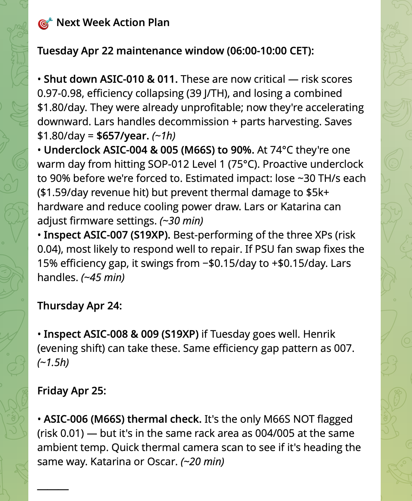
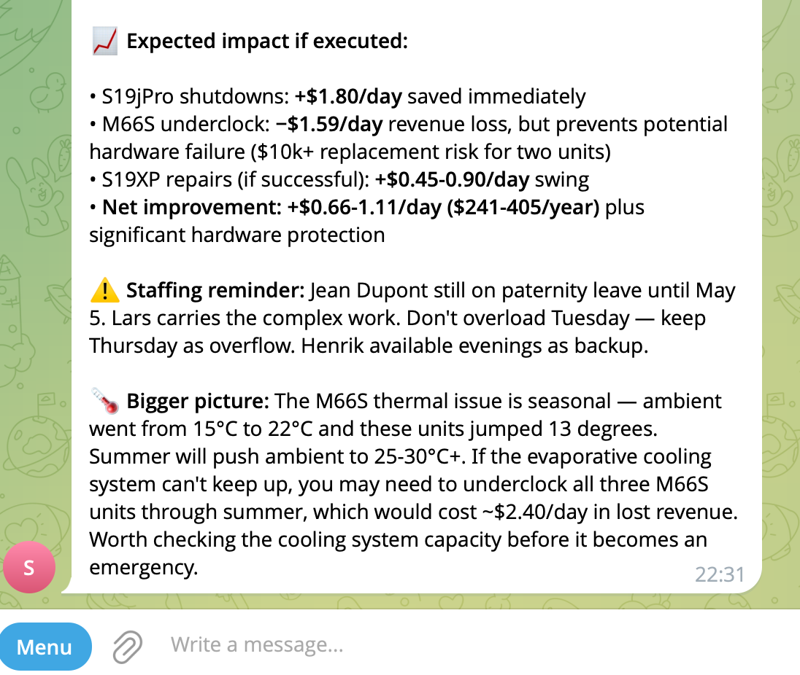
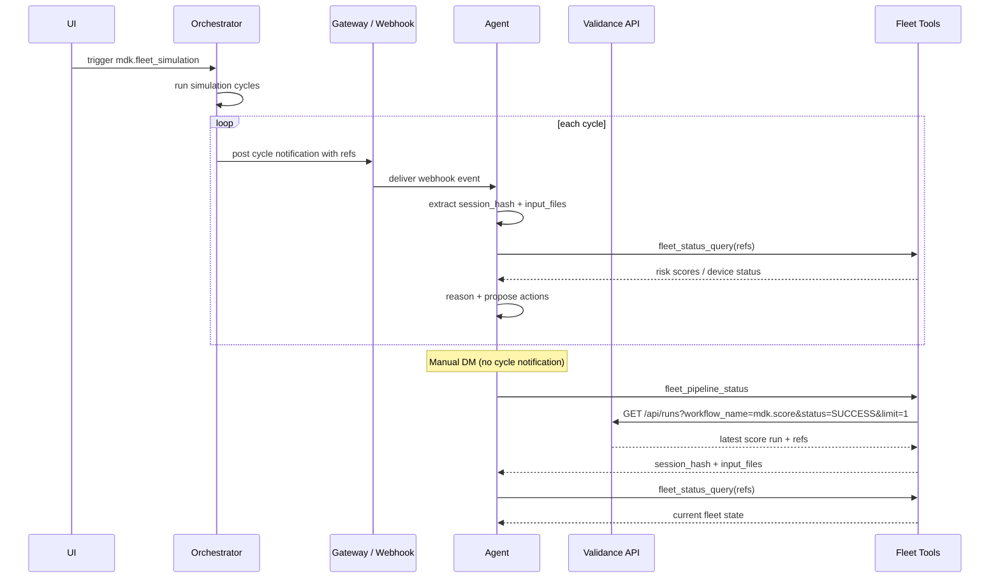

# Mining Optimization

AI-driven fleet intelligence for Bitcoin mining operations.

Supervised ML detection + LLM reasoning agent + human-in-the-loop governance. Detects hardware degradation days before failure, proposes cost-justified corrective actions, and enforces operator approval before anything touches hardware.


A sample pipeline report (summer_heatwave scenario, final cycle) is available at [`docs/sample-report.html`](docs/sample-report.html).

### AI Agent — Telegram Interaction (Summer Heatwave Simulation)






The simulation has progressed enough that ambient temperature rose from 15°C to 22°C (the summer heatwave scenario kicking in). The agent adapted its recommendations: the M66S units jumped from 61°C to 74°C and are now flagged, so it shifted from "monitor" to "proactive underclock before SOP-012 triggers." The agent combines real-time fleet telemetry, organizational knowledge (team roster, SOPs, parts inventory via RAG), and live market data (BTC price) into a concrete weekly maintenance schedule with per-device economic justification.

---

## Quick Start

### Prerequisites

- Python 3.11+
- Docker (for containerized execution via the workflow engine)

### Install dependencies (local development)

```bash
pip install pandas numpy scikit-learn xgboost matplotlib pyarrow scipy joblib requests pytest
```

### Generate synthetic data

```bash
# Single scenario (baseline, 10 devices, 30 days)
python scripts/generate_training_corpus.py --scenario data/scenarios/baseline.json

# Full training corpus (~1.6M rows, 5 scenarios)
python scripts/generate_training_corpus.py --all
```

### Run the pipeline locally (no Docker)

Each task is a standalone Python script that reads from and writes to its working directory (mirroring the `/work/` mount inside containers). All artifacts (parquets, models, JSONs, report) land in the same directory.

```bash
mkdir -p data/pipeline && cd data/pipeline

# Copy training data into the work directory (ingest expects these names)
cp ../training/training_telemetry.csv fleet_telemetry.csv
cp ../training/training_metadata.json fleet_metadata.json

TASKS=../../tasks

# Shared prefix: ingest → features → KPI
python $TASKS/ingest.py
python $TASKS/features.py
python $TASKS/kpi.py

# Training path
python $TASKS/train_model.py

# Inference path (requires trained model)
python $TASKS/score.py

# Analysis
python $TASKS/trend_analysis.py
python $TASKS/optimize.py
python $TASKS/report.py          # → report.html

# Validation report (36 SR checks against requirements)
python ../../scripts/generate_validation_report.py   # → validation-report.html
```

### Run via workflow engine (containerized)

The pipeline can be orchestrated by the [Validance](https://github.com/validance-io/sdk-python) workflow engine, adding content-addressed audit trails, container isolation, and artifact management. All orchestration scripts talk to the Validance API at `https://api.validance.io` ([interactive docs](https://api.validance.io/docs#/)), which already holds pre-trained model artifacts.

```bash
# Install the Validance SDK (zero dependencies, declaration only)
git clone git@github.com:validance-io/sdk-python.git
cd sdk-python && pip install -e . && cd ..

# Register workflows with the Validance API
python scripts/register_validance_workflows.py

# Training (optional — a pre-trained model 09605d5baa372954 already exists)
python scripts/orchestrate_training.py

# Inference chain: pre_processing → score → analyze
python scripts/orchestrate_inference.py --training-hash 09605d5baa372954

# With AI agent push (notifies OpenClaw when inference completes):
python scripts/orchestrate_inference.py --training-hash 09605d5baa372954 \
    --gateway-url http://172.18.0.1:19001 --gateway-token fleet-hook-2026

# Growing-window simulation (90 cycles)
python scripts/orchestrate_simulation.py --scenario summer_heatwave --training-hash 09605d5baa372954
```

### Run tests

```bash
pytest tests/ -v
```

The test suite (76 tests) generates a mini dataset (5 devices, 14 days), runs the full 8-task pipeline, and validates outputs:

| Test file | Tests | Coverage |
|-----------|-------|----------|
| `test_pipeline_integration.py` | 28 | End-to-end pipeline: data shapes, feature counts, model outputs, report generation |
| `test_trend_analysis.py` | 40 | Trend unit tests: OLS slopes, CUSUM detection, projected crossings, edge cases |
| `test_phase6_tasks.py` | 8 | Fleet control: tier classification, safety overrides, action generation |

---

## Project Structure

```
mining_optimization/
├── tasks/                          # Pipeline tasks (standalone Python scripts)
│   ├── ingest.py                   #   [1] CSV → Parquet, schema validation, dedup
│   ├── features.py                 #   [2] 75 engineered features (rolling, rates, z-scores, interactions)
│   ├── kpi.py                      #   [3] True Efficiency KPI + diagnostic decomposition
│   ├── train_model.py              #   [4a] XGBoost classifier + quantile regressors
│   ├── score.py                    #   [4b] 24h sliding window inference → risk scores
│   ├── trend_analysis.py           #   [5] CUSUM, OLS slopes, projected threshold crossings
│   ├── optimize.py                 #   [6] Tier classification + safety overrides
│   ├── report.py                   #   [7] HTML dashboard with charts
│   ├── fleet_status.py             #   Fleet status query (used by AI agent)
│   ├── control_action.py           #   Fleet control actions (underclock, maintenance)
│   ├── pipeline_status.py          #   Query Validance API for latest pipeline run refs
│   └── generate_batch.py           #   Batch data generation task
│
├── scripts/                        # Orchestrators and standalone tools
│   ├── orchestrate_training.py     #   Training chain (Pattern 1: continue_from)
│   ├── orchestrate_inference.py    #   Inference chain + AI agent notification
│   ├── orchestrate_simulation.py   #   Growing-window simulation loop
│   ├── physics_engine.py           #   CMOS power model, 10 anomaly types, 6 ASIC models
│   ├── simulation_engine.py        #   Per-device per-timestep tick simulation
│   ├── generate_training_corpus.py #   Multi-scenario corpus generator
│   └── register_validance_workflows.py  # Register mdk.* workflows with API
│
├── workflows/                      # Workflow DAG definitions (Validance SDK)
│   ├── fleet_intelligence.py       #   7 composable workflows (pre_processing, train, score, etc.)
│   └── fleet_simulation.py         #   Growing-window simulation wrapper
│
├── knowledge/                      # Organizational knowledge corpus (RAG)
│   ├── company-profile.md          #   Company overview, location, capacity
│   ├── team-roster.md              #   Personnel, shifts, availability
│   ├── hardware-inventory.md       #   ASIC models, batches, warranty
│   ├── maintenance-sops.md         #   Standard operating procedures
│   ├── facility-specs.md           #   Power, cooling, network infrastructure
│   ├── financial-overview.md       #   Energy rates, budget, BTC breakeven
│   ├── vendor-contacts.md          #   Suppliers, SLAs, spare parts
│   ├── safety-procedures.md        #   Emergency protocols, escalation
│   └── knowledge_corpus.md         #   Concatenated corpus (ingested by RAG pipeline)
│
├── tests/                          # Test suite (76 tests)
├── docs/                           # Documentation (see below)
├── data/                           # Generated data + pipeline artifacts (gitignored)
├── project_materials/              # Assignment brief, reference PDFs
├── Dockerfile                      # ML pipeline image (~500 MB)
└── Dockerfile.control              # Fleet control image (~50 MB, stdlib only)
```

### Docker Images

| Image | Dockerfile | Size | Purpose |
|-------|-----------|------|---------|
| `mdk-fleet-intelligence` | `Dockerfile` | ~500 MB | Full ML pipeline (pandas, XGBoost, scikit-learn, matplotlib) |
| `fleet-control` | `Dockerfile.control` | ~50 MB | Fleet status queries + control actions (stdlib only) |
| `rag-tasks` | (in validance-workflow) | ~120 MB | Knowledge query via RAG (httpx, numpy) |

---

## Three-Layer Architecture

```
① Hardware telemetry (5-min intervals)
        ↓
② ML Detection Pipeline          7-task DAG, containerized
   ingest → features → KPI       75 features, True Efficiency KPI
   → train/score → trends        XGBoost + quantile regressors
   → optimize → report           tier classification + safety overrides
        ↓
③ AI Reasoning Agent              LLM with three context layers:
   fleet_status_query             · ML perception (risk scores, tiers)
   web_search                     · Market context (BTC price)
   knowledge_query                · Organizational context (SOPs, team, specs)
        ↓
④ Governance Layer                approval gate, learned policies,
                                  rate limits, content-addressed audit
        ↓
⑤ MOS Command Execution          setFrequency, setPowerMode, reboot
```

See [`docs/architecture.svg`](docs/architecture.svg) for the full diagram.

---

## Integration Layers

This pipeline is a **client** of the Validance workflow engine. It does not depend on Validance at runtime — tasks are standalone Python scripts. The integration is at the orchestration level:

| Layer | Repository | Role |
|-------|-----------|------|
| **Workflow Engine** | `validance-workflow` | Executes tasks in containers, manages artifacts, content-addressed audit chain |
| **AI Agent Plugin** | `safeclaw` | Bridges the LLM agent to the governance API (approval gate, learned policies) |
| **AI Assistant** | `openclaw` | Personal AI assistant platform (hosts the reasoning agent) |
| **This repo** | `mining_optimization` | Pipeline tasks, physics engine, orchestrators, knowledge corpus |

---

## AI Agent Loop

The AI agent connects the ML pipeline to the operator. Two flows keep it in sync: **push** (simulation cycles notify the agent with fresh refs inline) and **pull** (the agent queries the Validance API for the latest pipeline run on manual queries).



**Push path** — each simulation cycle posts a notification (with `session_hash` + `input_files`) to the gateway webhook. The agent extracts the refs and queries fleet status directly.

**Pull path** — on manual DM queries (no cycle notification available), the agent calls `fleet_pipeline_status` which queries the Validance REST API for the latest successful `mdk.score` run and returns the current `session_hash` + `input_files` refs. No filesystem dependency — the agent always gets fresh data regardless of processing speed.

---

## AI Agent Configuration

The AI reasoning agent runs on [OpenClaw](https://openclaw.ai/) with the [SafeClaw](../safeclaw/) plugin bridging it to the Validance governance API. Below is the configuration specific to this mining project.

### OpenClaw (`~/.openclaw-dev/openclaw.json`)

```jsonc
{
  "agents": {
    "defaults": {
      "model": { "primary": "anthropic/claude-opus-4-6" },
      "workspace": "/root/.openclaw/workspace-dev",     // agent reads HEARTBEAT.md from here
      "contextPruning": { "mode": "off" },              // agent reads fresh workspace files every turn
      "heartbeat": {
        "every": "10m",                                  // heartbeat interval (10m dev, 30m+ prod)
        "target": "telegram",
        "to": "<telegram_user_id>",                      // operator's Telegram user ID
        "lightContext": true                              // only HEARTBEAT.md in bootstrap context
      }
    }
  },
  "hooks": {
    "enabled": true,
    "token": "<gateway-hook-token>",                     // must match --gateway-token in orchestrate_simulation.py
    "allowedAgentIds": ["main"]
  },
  "plugins": {
    "allow": ["safeclaw", "telegram", "anthropic"],
    "load": { "paths": ["<path-to-safeclaw-repo>"] },
    "entries": {
      "safeclaw": {
        "enabled": true,
        "config": {
          "kernelUrl": "http://localhost:8000",           // Validance prod API
          "trustProfile": "standard",                     // auto-approve reads, human-confirm writes
          "gatewayPort": 19001,                           // gateway port for approval webhooks
          "gatewayHost": "172.18.0.1"                     // Docker bridge IP (container → host)
        }
      }
    }
  },
  "channels": {
    "telegram": {
      "enabled": true,
      "botToken": "<telegram-bot-token>"                 // @SafeClowBot
    }
  },
  "gateway": {
    "port": 19001,                                       // orchestrator posts cycle notifications here
    "bind": "lan"
  }
}
```

### Workspace files (`/root/.openclaw/workspace-dev/`)

| File | Purpose |
|------|---------|
| `HEARTBEAT.md` | Agent instructions — the reasoning chain (Steps A–D), rules, tool call examples |
| `BOOTSTRAP.md` | Agent identity setup (first-run only) |

### SafeClaw plugin config (`safeclaw/`)

The plugin reads `workspacePath` from `api.config.agents.defaults.workspace` and passes it as a volume mount on every proposal.

**Trust profile: `standard`** — determines which actions auto-approve vs require human confirmation:

| Auto-approve | Human-confirm |
|-------------|---------------|
| `fleet_status_query`, `fleet_pipeline_status`, `web_search`, `knowledge_query` | `fleet_underclock`, `fleet_schedule_maintenance`, `fleet_emergency_shutdown` |

### Validance catalog templates (fleet-specific)

| Template | Image | Approval | Workspace | Purpose |
|----------|-------|----------|-----------|---------|
| `fleet_status_query` | `fleet-control` | auto | yes | Query risk scores, tier breakdown, device details |
| `fleet_pipeline_status` | `fleet-control` | auto | no | Query Validance API for latest pipeline run refs |
| `fleet_underclock` | `fleet-control` | human-confirm | yes | Reduce device clock speed (% of stock) |
| `fleet_schedule_maintenance` | `fleet-control` | human-confirm | yes | Schedule inspection or repair |
| `fleet_emergency_shutdown` | `fleet-control` | human-confirm | yes | Emergency device shutdown |

### Orchestrator → agent connection

The simulation orchestrator (`scripts/orchestrate_simulation.py`) notifies the agent after each cycle:

```
--gateway-url http://172.18.0.1:19001    # gateway webhook endpoint
--gateway-token <gateway-hook-token>     # must match hooks.token in openclaw.json
```

This posts to `POST /hooks/agent` with the cycle notification message containing `session_hash` and `input_files` refs. The agent then follows `HEARTBEAT.md` to assess, reason, and propose actions.

---

## Documentation

### Deliverables

| Document | Contents |
|----------|----------|
| [`docs/technical-report.md`](docs/technical-report.md) | Technical report (assignment deliverable) |
| [`docs/architecture.svg`](docs/architecture.svg) | End-to-end architecture diagram |
| [`docs/architecture-diagram.md`](docs/architecture-diagram.md) | Architecture diagram (ASCII, detailed) |
| [`docs/validation-report.html`](docs/validation-report.html) | Validation report — 36 SR checks against requirements |

### Reference

| Document | Contents |
|----------|----------|
| [`docs/system-overview.md`](docs/system-overview.md) | System overview, data flow, controller tiers, tech stack |
| [`docs/code-documentation.md`](docs/code-documentation.md) | Per-file code documentation |
| [`docs/feature-catalog.md`](docs/feature-catalog.md) | Complete feature catalog (75 features, computation, rationale) |
| [`docs/true-efficiency-kpi.md`](docs/true-efficiency-kpi.md) | True Efficiency KPI formulation and decomposition |
| [`docs/evaluation-analysis.md`](docs/evaluation-analysis.md) | Model evaluation, threshold analysis |
| [`docs/user-guide.md`](docs/user-guide.md) | Operational user guide |
| [`docs/requirements.md`](docs/requirements.md) | Functional and non-functional requirements |

### MOS / MDK References

- [mos.tether.io](https://mos.tether.io) — MiningOS (open-source, Apache 2.0)
- [mdk.tether.io](https://mdk.tether.io) — Mining Development Kit
- [github.com/tetherto](https://github.com/tetherto) — MOS source repositories (`miningos-*` prefix)

Key repos: [antminer worker](https://github.com/tetherto/miningos-wrk-miner-antminer) (telemetry fields, control commands), [orchestrator](https://github.com/tetherto/miningos-wrk-ork) (approval system, fleet aggregation).
