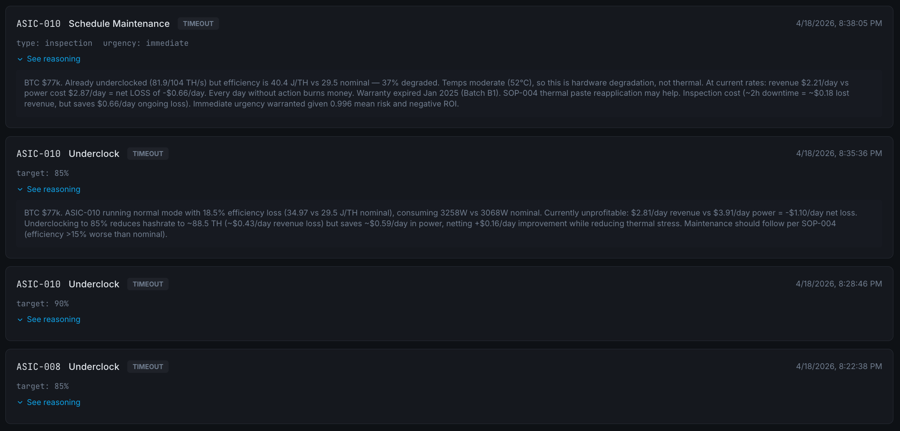
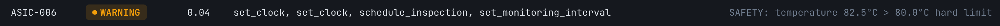

## Abstract

Bitcoin mining profitability is dominated by marginal gains in energy efficiency and by the avoidance of unplanned hardware failures, yet most operators rely on the naive joules-per-terahash (J/TH) metric and reactive maintenance. We present a three-layer fleet intelligence architecture that addresses both limitations through a single pipeline: (i) a deterministic ML detection layer that ingests ASIC telemetry, engineers physics-informed features, computes a composite **True Efficiency (TE)** key performance indicator, and classifies device health; (ii) a contextual AI reasoning layer that synthesizes ML perception with market and organizational signals to propose justified corrective actions; and (iii) a governance layer that enforces human approval, learned policies, and a tamper-evident audit trail before any action reaches hardware. TE is defined as a decomposition separating hardware-intrinsic efficiency, voltage inefficiency, and cooling overhead, each mapping to a distinct failure mode. A supervised XGBoost ensemble trained on 1.5 M rows of physics-based synthetic telemetry achieves device-level precision and recall of 1.00 across 57 devices and 5 scenarios, with a mean detection lead time of **321.7 hours (≈ 13.4 days)** before the ground-truth failure label activates. We discuss operational benefits, the security implications of an autonomous optimization agent, and a defense-in-depth posture built around hard-coded safety overrides that bound every upstream decision.

---

## 1. Problem Statement

Bitcoin mining profitability now depends on marginal gains. Operators manage heterogeneous ASIC fleets — S21-HYD, M66S, S19XP, S19j/kPro, A1566 — across sites where ambient conditions, energy price, and hardware health move continuously. Two cost drivers dominate operational expenditure.

**Chip-level efficiency.** Each ASIC has an operating point defined by clock frequency, core voltage, temperature, and cooling load. In current practice, mode selection is performed manually and guided by operator intuition, using a metric — joules per terahash (J/TH) — that conflates hardware quality, voltage waste, and cooling overhead into a single figure of merit.

**Hardware failure.** ASIC repair is the single largest cost line in fleet operations. Failures almost always manifest as gradual degradation (thermal fouling, power-supply drift, chip aging) that is visible in telemetry days before a device goes critical. Yet operators today have no systematic early-warning system, and maintenance is predominantly reactive.

This project addresses both problems with a single pipeline. A supervised ML layer identifies degradation and classifies device health; an AI reasoning layer synthesizes this signal with market data and organizational knowledge to propose specific corrective actions; and a governance layer enforces human approval and audit before any action reaches hardware.

---

## 2. System Architecture

Three functional layers sit between the fleet and the MOS (Mining Operating System) control plane. Each layer has a single responsibility and communicates with the next through typed artifacts. The layer boundaries are themselves the safety story: **ML classifies (deterministic), AI reasons (contextual), Governance approves (auditable), and hard-coded safety overrides bound every decision made above them.**

**(1) Hardware** emits raw telemetry every 5 minutes: hashrate, power, voltage, clock, chip temperature, cooling power, and ambient temperature. In production this stream originates from MOS workers (`miningos-wrk-miner-antminer`) via Hyperbee time-series; in this prototype it is produced by a physics-based generator (§4.1).

**(2) ML Detection Pipeline** is a seven-task directed acyclic graph: *ingest → features → KPI → train/score → trends → optimize → report*. Every task runs inside a container, reads and writes a shared `/work/` directory, and emits content-addressed artifacts. Any task can be rerun in isolation; each rerun produces a new session hash that links its output to its exact inputs, code, and parameters.

**(3) AI Reasoning** is an LLM agent that activates at the end of each pipeline cycle and gathers three complementary context layers before proposing any action: *ML perception* (risk scores, tier, TE decomposition, projected failure horizon) from the pipeline; *market context* (BTC price, hashprice) from web search; and *organizational context* (standard operating procedures, team availability, hardware specifications, financial constraints) from a single-shot retrieval-augmented-generation (RAG) query over an indexed corpus of company documents. The agent does not read files directly — all data flows through the same governed API it uses to submit proposals.

**(4) Governance** is a human-in-the-loop approval gate with learned policies, per-session rate limits, and a tamper-evident audit trail. Read-only queries auto-approve under a standard trust profile; anything that modifies hardware state requires human confirmation or a standing policy created by the operator.

**(5) Command Execution** is a thin MOS RPC layer exposing `setFrequency`, `setPowerMode`, `setFanControl`, and `reboot`. Notably, MOS does not expose direct voltage control — voltage is coupled to frequency through the ASIC's V/f curve, so all safety reasoning must be expressed in frequency space.

---

## 3. The True Efficiency KPI

### 3.1 Limitations of naive J/TH

The standard mining efficiency metric is the ratio of ASIC power draw to hashrate:

$$
\mathrm{J/TH}_{\text{naive}} \;=\; \frac{P_{\text{ASIC}}}{H}
$$

This metric conflates three independent dimensions that the operator must separate in order to act:

1. **Cooling overhead.** A miner operating at 15 J/TH with 400 W of cooling is not economically equivalent to one operating at 15 J/TH with 1 kW of cooling.
2. **Voltage waste.** CMOS power scales quadratically with voltage; overvolting by 30 mV costs disproportionately more power per hash. The naive metric hides whether the chip is on the efficient part of its V/f curve.
3. **Ambient bias.** A device at –5 °C ambient naturally looks better than the same device at +20 °C ambient. Raw J/TH conflates hardware quality with geography.

### 3.2 Formulation

True Efficiency (TE) is defined to separate what the operator controls from what the environment provides:

$$
\mathrm{TE} \;=\; \frac{P_{\text{ASIC}} \;+\; P_{\text{cooling}}^{\text{norm}}}{H \cdot \eta_{v}} \quad [\mathrm{J/TH},\ \text{lower is better}]
$$

**Voltage efficiency factor $\eta_{v}$.** This term captures how far the operating voltage sits from the minimum stable voltage for the current clock frequency. Let $V_{\text{stock}}$ and $f_{\text{stock}}$ denote the manufacturer's nominal voltage and frequency; then

$$
V_{\text{opt}}(f) \;=\; V_{\text{stock}} \left( \frac{f}{f_{\text{stock}}} \right)^{\!\alpha}, \qquad \alpha = 0.6,
$$

$$
\eta_{v} \;=\; \left( \frac{V_{\text{opt}}(f_{\text{actual}})}{V_{\text{actual}}} \right)^{\!2}.
$$

The exponent $\alpha = 0.6$ reflects the sub-linear V/f scaling of modern CMOS process nodes. Overvolting drives $\eta_{v}$ below unity; power-supply instability appears as volatility in $\eta_{v}$.

**Ambient-normalized cooling $P_{\text{cooling}}^{\text{norm}}$.** To remove geographic bias, cooling power is projected to a reference ambient of 25 °C:

$$
P_{\text{cooling}}^{\text{norm}} \;=\; P_{\text{cooling}} \cdot \frac{T_{\text{chip}} - 25\,^\circ\mathrm{C}}{\max\!\left(T_{\text{chip}} - T_{\text{ambient}},\; 1\,^\circ\mathrm{C}\right)}.
$$

### 3.3 Diagnostic decomposition

TE factors into three multiplicative components, each isolating a single physical mechanism:

$$
\mathrm{TE} \;=\; \mathrm{TE}_{\text{base}} \cdot \frac{1}{\eta_{v}} \cdot R_{\text{cool}},
$$

where

$$
\mathrm{TE}_{\text{base}} \;=\; \frac{P_{\text{ASIC}}}{H}, \qquad R_{\text{cool}} \;=\; \frac{P_{\text{ASIC}} + P_{\text{cooling}}^{\text{norm}}}{P_{\text{ASIC}}}.
$$

| Factor | Meaning | Anomaly signal |
|---|---|---|
| $\mathrm{TE}_{\text{base}}$ | Hardware-intrinsic efficiency | Hashrate decay (chip aging) |
| $1/\eta_{v}$ | Voltage penalty | PSU instability, capacitor aging |
| $R_{\text{cool}}$ | Cooling overhead | Thermal fouling, fan wear |

This decomposition is the critical design choice: rather than train a model on 17 correlated raw signals, we train it on *which TE component is drifting*. Each component isolates a single physical mechanism, making the model's outputs interpretable and mapping its predictions directly onto maintenance categories. A device with $\mathrm{TE}_{\text{score}} = 1.0$ is at nominal performance; a score below 0.9 triggers investigation, and the decomposition answers *why*.

---

## 4. Data Pipeline

### 4.1 Synthetic dataset

The training corpus (~1.6 M rows) is produced by composing five physics-based scenarios with deterministic seeds. Each scenario uses the same physics engine but a different anomaly mix:

| Scenario | Fleet | Duration | Injected anomalies |
|---|---|---|---|
| `baseline` | 10 devices | 30 days | none (healthy reference) |
| `summer_heatwave` | 12 devices | 90 days | thermal degradation, dust fouling, thermal-paste degradation |
| `psu_degradation` | 10 devices | 60 days | PSU instability, capacitor aging |
| `cooling_failure` | 12 devices | 90 days | thermal degradation, coolant-loop fouling, fan-bearing wear |
| `asic_aging` | 15 older devices | 180 days | hashrate decay, solder-joint fatigue, firmware cliff |

The physics engine implements per-device, per-timestep simulation grounded in a CMOS power model

$$
P \;=\; k \cdot V^{2} \cdot f \;+\; P_{\text{static}}(T),
$$

an exponential-approach thermal model with thermal inertia $\tau = 0.4$ h, a proportional cooling controller, rule-based operating-mode selection, and a sinusoidal ambient temperature curve seeded at 64.5° N latitude for realistic seasonal and diurnal variation.

### 4.2 Feature engineering

Feature engineering follows directly from the TE decomposition: rather than feed raw telemetry to the model, we construct features that isolate the physical mechanism each TE component exposes.

- **Rolling statistics** at four horizons (30 min, 1 h, 12 h, 24 h, 7 d) capture gradual degradation at multiple timescales.
- **Fleet-relative z-scores** detect single-device deviation from same-model peers, providing natural resistance to site-wide drift (e.g., a heatwave that equally affects every device is not an anomaly).
- **Rates of change** flag sudden shifts — firmware cliffs, fan failures — that do not register as sustained-mean deviations.
- **Interaction terms** encode physics relationships directly: power per gigahertz, thermal headroom, cooling effectiveness.

The classifier trains on 50 of 75 engineered features; the quantile regressor adds 8 autoregressive temporal features for forward projection. The complete feature list with formulae, windows, and rationale is given in the [feature catalog](https://github.com/Wik-dev/mining_optimization/blob/main/docs/feature-catalog.md).

---

## 5. AI Layer and Results

### 5.1 Classification

An XGBoost classifier with `n_estimators=200`, `max_depth=6`, and `scale_pos_weight` for class imbalance is trained on the full 1.6 M-row corpus (1,509,447 rows; 57 devices across 5 scenarios). The decision threshold is set at 0.3 — biased toward recall, since in mining a missed failure costs far more than an unnecessary inspection. The model trains 10 independent binary classifiers, one per anomaly type:

| Anomaly type | Positive rate | Devices | Dominant feature (`importance`) |
|---|---:|---:|---|
| `hashrate_decay` | 12.4 % | 4 | `efficiency_jth_fleet_z` (0.34) |
| `solder_joint_fatigue` | 7.4 % | 3 | `chip_count_active` (1.00) |
| `capacitor_aging` | 6.4 % | 4 | `te_score` (0.49) |
| `dust_fouling` | 3.7 % | 4 | `ambient_temp_c` (0.63) |
| `psu_instability` | 3.0 % | 3 | `power_w_std_1h` (0.59) |
| `thermal_paste_deg` | 2.4 % | 2 | `power_w_mean_7d` (0.90) |
| `firmware_cliff` | 2.2 % | 1 | `power_w_mean_7d` (0.74) |
| `fan_bearing_wear` | 2.0 % | 3 | `fan_rpm` (0.62) |
| `coolant_loop_fouling` | 1.6 % | 2 | `hashrate_th_mean_7d` (0.89) |
| `thermal_deg` | 0.4 % | 1 | `power_w_mean_7d` (0.63) |

Each sub-classifier specializes cleanly: the dominant feature in every case aligns with the physical mechanism of the anomaly it detects (fan RPM for bearing wear, chip count for solder-joint fatigue, voltage ripple for capacitor aging). The overall positive rate is 41 %, inflated because multiple degradation types overlap in the multi-scenario corpus and each device can exhibit several failure modes simultaneously.

Full-fleet validation against the physics engine's ground-truth labels yields:

| Granularity | Precision | Recall | F1 | TP | TN | FP | FN |
|---|---:|---:|---:|---:|---:|---:|---:|
| **Device-level** | 1.000 | 1.000 | 1.000 | 27 | 30 | 0 | 0 |
| **Sample-level** | 0.983 | 0.998 | 0.990 | 621,429 | 875,949 | 10,519 | 1,550 |

All 27 anomalous devices across all 5 scenarios are correctly flagged with zero device-level false positives or false negatives. The 10,519 sample-level false positives cluster in healthy devices under environmental stress (the `summer_heatwave` scenario); the 1,550 false negatives occur during early anomaly onset, before degradation reaches a detectable intensity.

**Early detection lead time.** A critical operational property is that the model fires *before* the physics engine's ground-truth label activates — it catches the precursor signal:

| Metric | Value |
|---|---|
| Mean detection lead time | **321.7 h (≈ 13.4 days)** |
| Median lead time | **241.5 h (≈ 10 days)** |
| Worst case | **0.0 h (detected at onset)** |

Gradual-onset anomalies (`capacitor_aging`, `psu_instability`) show shorter lead times because the underlying signal builds slowly; acute failures (`solder_joint_fatigue`, `fan_bearing_wear`) are caught earlier because their signatures are abrupt and unambiguous.

### 5.2 Feature importance

The aggregate model's top features validate the TE decomposition as a feature-engineering strategy: TE-derived features (`te_score`, `te_base`, `hashrate_ratio`, `efficiency_jth_mean_7d`) together account for 34 % of total predictive gain.

| Rank | Feature | Gain | Physical meaning |
|---:|---|---:|---|
| 1 | `reboot_count` | 16.2 % | Operational stress / instability history |
| 2 | `te_score` | 13.3 % | TE composite — validates KPI design |
| 3 | `hashrate_ratio` | 8.2 % | Actual vs. nominal — chip degradation |
| 4 | `efficiency_jth_mean_7d` | 7.0 % | Weekly efficiency trend — gradual drift |
| 5 | `te_base` | 5.9 % | Hardware-intrinsic efficiency component |
| 6 | `chip_count_active` | 4.1 % | Chip dropout — solder-joint failure |
| 7 | `fan_rpm` | 4.0 % | Cooling health — bearing wear |
| 8 | `voltage_ripple_std_24h` | 3.5 % | PSU instability marker |
| 9 | `power_w_std_1h` | 2.6 % | Short-term power volatility |
| 10 | `voltage_v_std_1h` | 2.4 % | Voltage noise — capacitor aging |

The weakest signal remains `dust_fouling`, which manifests similarly to ordinary ambient variation; closing that gap requires ambient-conditioned thermal-resistance features rather than threshold tuning.

### 5.3 Forward-looking predictions

Alongside the classifier, a set of quantile regressors produces TE forecasts at four horizons ($t + 1$ h, $6$ h, $24$ h, $7$ d) with 80 % prediction intervals ($p_{10}$ / $p_{50}$ / $p_{90}$). The trend-analysis task adds CUSUM regime-change detection and projected TE-threshold crossings. In validation, 7 of 14 devices in the scoring window were correctly predicted to remain below the $\mathrm{TE} = 0.8$ degraded threshold across all horizons, with narrow prediction intervals (typical width 0.02–0.08) indicating confident forecasts. This elevates the system from alerting to **forecasting**: the agent receives a projected failure horizon with a confidence band, not merely a current-state probability.

### 5.4 The AI reasoning loop

After each scoring cycle, the orchestrator notifies the LLM agent with the pipeline session hash. The agent queries the three context layers and, for every flagged device, composes a cost–benefit rationale. A representative example:

> *"BTC $97,200. ASIC-004 at 67.6 °C, efficiency 27 % worse than nominal (27.1 vs 21.3 J/TH). SOP-004 prescribes underclock-first for thermal degradation. Underclocking to 90 % reduces revenue by ~$0.35/day but saves ~$0.84/day in wasted power. Net: +$0.49/day plus extended hardware life. Maintenance window: schedule after Jean returns May 5."*

The agent submits the proposal through the governance API with the pipeline's session hash, so that ML evidence and AI proposal appear together in the operator dashboard.

---

## 6. Operational Benefits

- **Failure prevention.** Early-warning signals, in most cases days before critical failure, allow the operator to schedule controlled underclocking or maintenance rather than absorb the full cost of a failed PSU, fouled heatsink, or burned-out capacitor.
- **Corrected comparisons.** TE makes heterogeneous devices and sites directly comparable for the first time. The same metric applies across hydro-cooled northern sites and air-cooled southern sites, allowing hardware-deployment decisions to be made on real operating data rather than manufacturer J/TH figures.
- **Quantified trade-offs.** Every proposed action carries an explicit \$/day calculation built from current BTC price, current efficiency loss, and current power cost. Underclocking is no longer a judgment call but a net-positive economic decision with a quantified magnitude.
- **Zero approval fatigue at scale.** Learned policies allow the operator to automate recurring safe patterns (e.g., "always approve underclock to 80 % for S19jPro when risk > 0.9") while preserving the audit trail and the human veto. Approvals reach the operator through both a web dashboard and a Telegram bot, because PSU alerts do not wait until the operator is at a desk.

---

## 7. Security and Safety

An autonomous agent that can underclock, overclock, or shut down mining hardware introduces a class of risk that does not exist in a passive monitoring system. Model error, stale data, prompt injection, or adversarial input could in principle issue a command that damages hardware, wastes energy, or halts revenue. Defense-in-depth, in which multiple independent layers are each individually sufficient to prevent harm, is the only acceptable posture.

1. **Separation of perception, reasoning, and action.** The ML layer only classifies (deterministic, no side effects). The AI agent only proposes (it cannot execute). The governance layer only approves or denies. A failure in any one layer is caught by the others.
2. **Fail-closed design.** Every proposal has a timeout — no human response defaults to **deny**, never approve. If telemetry is missing, no features are computed and no action is proposed. The system fails toward inaction.
3. **Hard-coded physical limits.** Before tier logic runs, deterministic safety overrides are evaluated: $T > 80\,^\circ\mathrm{C} \Rightarrow$ force 80 % clock; $T < 10\,^\circ\mathrm{C} \Rightarrow$ sleep (coolant-viscosity and PCB-condensation risk at the northern site); $V > 1.10 \cdot V_{\text{stock}} \Rightarrow$ reset frequency to stock. These bounds live in code, not in prompts — they cannot be overridden by model output or agent reasoning.
4. **Container isolation.** Every task and every agent action executes inside an isolated container with no host-filesystem access and an explicit egress allowlist. API keys are injected at runtime from a secret store and never embedded in code or images.
5. **Content-addressed audit chain.** Every workflow execution is identified by a SHA-256 hash over its code, parameters, and inputs. Every agent proposal is logged with the input state that triggered it, the approval decision, and the execution result. Retroactively altering any input breaks the chain.
6. **Adversarial robustness via fleet-relative features.** A compromised device reporting falsified telemetry diverges from its same-model peers — the z-score features detect this rather than being deceived by it. The residual risk is fleet-wide sensor drift, which is acknowledged and out of scope for this iteration.

---

## 8. Future Work

- **Real-fleet validation.** Synthetic data validates the pipeline and KPI design, but real-world failures co-occur, sensors drift, and baselines are non-stationary. Dust-fouling detection in particular will require ambient-conditioned features once live MOS data is available.
- **Streaming inference.** Moving from 24-hour batch scoring to 5-minute streaming with immediate tier reclassification. The growing-window architecture already accumulates history correctly; the bottleneck is cycle time, not architecture.
- **MOS RPC integration.** The `fleet_underclock` template currently logs the intended MOS command; live integration requires TLS client certificates and the MOS gateway endpoint — a deployment step, not an architecture change.
- **Multi-site orchestration.** The current scope is single-site. Cross-site coordination (hashrate floors, energy-price arbitrage) is a natural extension once the single-site control loop is validated against real hardware.

---

## 9. Repository and Artifacts

### Repository layout

| Directory | Contents |
|---|---|
| [`tasks/`](https://github.com/Wik-dev/mining_optimization/tree/main/tasks) | Pipeline tasks — standalone Python scripts (ingest, features, KPI, train, score, trends, optimize, report) |
| [`scripts/`](https://github.com/Wik-dev/mining_optimization/tree/main/scripts) | Orchestrators, physics engine, data generation |
| [`workflows/`](https://github.com/Wik-dev/mining_optimization/tree/main/workflows) | Workflow DAG declarations (Validance SDK) |
| [`docs/`](https://github.com/Wik-dev/mining_optimization/tree/main/docs) | [Technical report](https://github.com/Wik-dev/mining_optimization/blob/main/docs/technical-report-final.md), [feature catalog](https://github.com/Wik-dev/mining_optimization/blob/main/docs/feature-catalog.md), [user guide](https://github.com/Wik-dev/mining_optimization/blob/main/docs/user-guide.md) |
| [`example_output_report/`](https://github.com/Wik-dev/mining_optimization/tree/main/example_output_report) | Sample pipeline output ([`sample-report.html`](https://github.com/Wik-dev/mining_optimization/blob/main/example_output_report/sample-report.html)) |

### Verification and validation

| Document | Contents |
|---|---|
| [`docs/requirements.md`](https://github.com/Wik-dev/mining_optimization/blob/main/docs/requirements.md) | 36 functional and non-functional requirements traced to implementation |
| [`tests/validation-report.html`](https://github.com/Wik-dev/mining_optimization/blob/main/tests/validation-report.html) | Automated V&V report: every requirement mapped to a test, with pass/fail status across the full 1.5 M-row corpus |

### Workflows

| Workflow | Tasks | Description |
|---|---:|---|
| [`mdk.pre_processing`](https://github.com/Wik-dev/mining_optimization/blob/main/workflows/fleet_intelligence.py) | 3 | Ingest → features → KPI (shared prefix for training and inference) |
| [`mdk.train`](https://github.com/Wik-dev/mining_optimization/blob/main/workflows/fleet_intelligence.py) | 1 | XGBoost classifier + quantile regressors |
| [`mdk.score`](https://github.com/Wik-dev/mining_optimization/blob/main/workflows/fleet_intelligence.py) | 1 | Score fleet with pre-trained model |
| [`mdk.analyze`](https://github.com/Wik-dev/mining_optimization/blob/main/workflows/fleet_intelligence.py) | 3 | Trends → optimize → report |
| [`mdk.generate_corpus`](https://github.com/Wik-dev/mining_optimization/blob/main/workflows/fleet_intelligence.py) | 1 | Synthetic training data generation (all scenarios) |
| [`mdk.generate_batch`](https://github.com/Wik-dev/mining_optimization/blob/main/workflows/fleet_intelligence.py) | 1 | Stateful simulation batch generation |
| [`mdk.fleet_simulation`](https://github.com/Wik-dev/mining_optimization/blob/main/workflows/fleet_simulation.py) | 1 | Growing-window simulation wrapper (UI-triggerable) |
