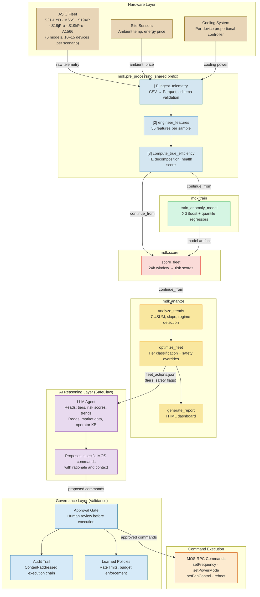

# Architecture Diagram — Fleet Intelligence Pipeline

**Two-Layer Architecture: ML Detection → AI Reasoning → Approval Gate**



## Workflow Composition

```
Training path:
  mdk.generate_corpus → mdk.pre_processing → mdk.train
                         (continue_from)      (continue_from)

Inference path:
  mdk.pre_processing → mdk.score → mdk.analyze
  (continue_from)      (continue_from)

Continuous simulation:
  mdk.fleet_simulation (persistent orchestrator)
    Cycle 0:  mdk.pre_processing → mdk.train
    Cycle 1+: mdk.pre_processing → mdk.score → mdk.analyze
```

## Two-Layer Architecture

| Layer | Role | Components | Output |
|-------|------|-----------|--------|
| **ML Detection** | Perceive & classify | pre_processing, train/score, analyze | Tiers, risk scores, safety flags |
| **AI Reasoning** | Decide & propose | SafeClaw agent + operator KB | Specific MOS commands + rationale |
| **Governance** | Approve & audit | Validance approval gate + policies | Approved commands + audit trail |

The ML layer outputs deterministic, reproducible observations. The AI agent adds contextual reasoning (market conditions, maintenance schedules, operator preferences). The governance layer ensures every action is traceable and approved.

## Data Flow Summary

```
Hardware ──→ fleet_telemetry.csv
         ──→ telemetry.parquet
         ──→ features.parquet + kpi_timeseries.parquet
         ──→ anomaly_model.joblib (training) / fleet_risk_scores.json (inference)
         ──→ trend_analysis.json + fleet_actions.json (tiers + safety flags)
         ──→ SafeClaw agent proposes MOS commands
         ──→ Validance approval gate
         ──→ MOS RPC execution + HTML report
```
