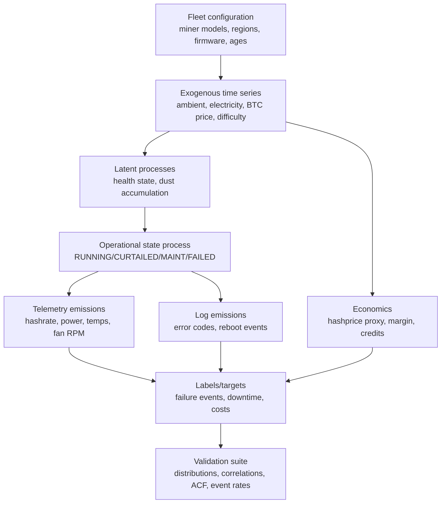

# Bitcoin Mining Predictive Signals and Realistic Synthetic Data Generation for Predictive Modeling

## Executive summary

Bitcoin mining operations are “sensor-rich” industrial computing systems whose economics are dominated by electricity and whose reliability is dominated by thermal management, airflow, and the health of a small number of replaceable subassemblies (fans, PSU, control board, hashboards). Manufacturer documentation provides unusually useful constraints for building **realistic** per-machine distributions—most importantly explicit tolerance bands on hashrate and power (e.g., ±3% hashrate and ±5% power for a modern Bitmain unit), environmental operating ranges (temperature/humidity/altitude), and common fault patterns observable in kernel logs (fan lost, overtemperature protection, missing chips/boards, power/network faults). citeturn20view0turn24view0

For predictive modeling, the strongest **leading indicators of failures** are (a) temperature trajectories (chip/inlet/ambient), (b) power-per-TH (“efficiency”) drift, (c) hashrate degradation at fixed power, and (d) structured error logs and reboot/reset frequency. Bitmain support materials explicitly tie overtemperature events to dust accumulation and airflow/ventilation quality and recommend monthly dust cleaning as preventive maintenance—creating a concrete opportunity to model degradation + maintenance as a partially observed stochastic process. citeturn24view0turn24view1turn20view0

For **cost prediction**, the two dominant drivers are (1) electricity price (including credits and adders) and (2) network “revenue per unit hashrate,” which is driven by BTC price and protocol difficulty adjustments (difficulty adjusts approximately every 2,016 blocks to target ~10-minute blocks). Operational decisions such as curtailment and demand-response participation create nontrivial state behavior (RUNNING vs CURTAILED vs MAINTENANCE), which should be treated as a modeled latent or discrete state rather than “noise.” citeturn25view0turn7search14turn7search22

Public-company mining disclosures provide unusually strong “anchor points” for modeling **fleet-level uptime and power cost**: for example, Riot reports both deployed hashrate and average operating hashrate, plus “all‑in power cost” (inclusive of transmission/distribution charges, fees, adders, and taxes, net of power credits). Such disclosures can calibrate availability and effective electricity cost distributions for US-style industrial operations. citeturn25view0turn25view1

Finally, **hardware replacement lifetimes** must be modeled as both (a) physical survival (components fail) and (b) economic obsolescence (machines become uncompetitive). Peer‑reviewed work on Bitcoin mining e‑waste argues that economic turnover can be very fast (on the order of ~1–2 years in some periods), which materially affects depreciation priors, spares strategy, and forecast horizons. citeturn2search0turn2search3

## Operational metrics and reliability distributions

Manufacturers such as entity["company","Bitmain","asic miner maker"], entity["company","MicroBT","whatsminer maker"], and entity["company","Canaan Inc.","avalon miner maker"] publish key constraints that are directly usable as distributional priors: hashrate/power tolerances, environmental ranges, and (in some cases) cautions that imply causal effects (e.g., non-vertical placement increasing failure rate). citeturn20view0turn20view1turn23view0

### Key operational metrics and empirically grounded distribution choices

**Per-machine hashrate (TH/s)**  
*What sources constrain:* Bitmain’s S21 guide lists typical hashrate values and explicitly states actual hashrate fluctuates by ±3% around typical at specified inlet temperature. citeturn20view0  
*Recommended model:* multiplicative lognormal around a per‑unit baseline, with σ derived from tolerance bands.  
*Parameterization heuristic:* if “±3%” is treated as an approximate 95% envelope, σ ≈ 0.03/1.96 ≈ 0.015 (log-space). (Treat as a prior; validate against real fleet telemetry.)

**Hashrate variability and degradation**  
*What sources constrain:* Manufacturer tolerances bound normal dispersion; Bitmain troubleshooting emphasizes dust/airflow and overtemperature protection as common pathways to performance loss. citeturn24view0turn24view1  
*Recommended model:* add (a) short-term lognormal noise and (b) a slow latent degradation process (random walk or mean‑reverting) linked to dust index, temperature stress, and age; reset/improve after maintenance.

**Power consumption (W) and efficiency (J/TH)**  
*What sources constrain:* Bitmain: power on wall and efficiency fluctuate ±5% around typical; MicroBT manual includes a power range and a stated tolerance (e.g., “Power On Wall … ±10%” and “Power Ratio … ±5%”). citeturn20view0turn20view1  
*Recommended model:* lognormal (or normal on relative error) around baseline; couple power to hashrate using efficiency with correlated noise.

**Temperature (ambient / inlet / chip)**  
*What sources constrain:* Bitmain S21 provides operating temperature/humidity/altitude ranges; Bitmain troubleshooting links overtemperature to dust and airflow; ASHRAE guidance for data-processing equipment provides a widely used recommended inlet range (18–27°C) that can be used as an engineering prior for reliability/energy tradeoffs even if mining sites sometimes operate outside it. citeturn20view0turn24view0turn26search1  
*Recommended model:*  
- Ambient: seasonal + diurnal + stochastic (AR(1) + sinusoid).  
- Inlet: ambient + recirculation term (function of facility design and load).  
- Chip: inlet + thermal rise proportional to kW load and inversely related to airflow/cooling state.

**Uptime/downtime (availability) at unit and fleet levels**  
*What sources constrain:* Riot publicly reports “Deployed Hash Rate” and “Avg. Operating Hash Rate,” offering a measurable proxy for availability that includes curtailment, maintenance, and failures. In Dec 2025, 34.9 EH/s average operating vs 38.5 EH/s deployed suggests ~90.6% operating/deployed for that reported month (interpret as fleet utilization). citeturn25view0  
*Recommended model:* semi-Markov state process with states {RUNNING, CURTAILED, MAINTENANCE, FAILED}, plus duration distributions by state.

**MTBF and failure modes**  
*What sources constrain:* Manufacturers rarely publish MTBF, but they do publish dominant *observable* fault categories. Bitmain’s troubleshooting guide enumerates fault phenomena and log markers for fan abnormal (ERROR_FAN_LOST), PIC read errors (“fail to read pic temp”), missing chips/boards, network failure, power failure, and overtemperature protection; these are practical failure-mode classes for competing-risks modeling. citeturn24view0  
*Recommended priors (when you lack fleet history):* wide lognormal prior over MTBF by component class, then update with your own repair tickets/log labels. A realistic synthetic generator should treat failure rates as *fleet-size scaled*: per-miner failures are infrequent, but farms with thousands of units see daily events.

**Maintenance schedules and firmware/software issues**  
*What sources constrain:* Bitmain recommends cleaning/dusting “once a month,” with procedural detail (air compressor/air gun pressure, shutdown requirement). citeturn24view1  
Bitmain troubleshooting suggests firmware upgrade or SD-card flashing as attempted remedies for certain abnormal readings (PIC-related issues). citeturn24view0  
Bitmain also publishes structured inspection requirements for liquid-cooling container systems (ANTSPACE HK3), useful as a template for high-frequency maintenance check schemas (temperatures, pressures, flows). citeturn26search3

**Replacement lifetimes (economic vs physical)**  
Peer‑reviewed work on Bitcoin’s e‑waste argues that hardware turnover driven by rapid efficiency improvements can yield short effective lifetimes (order ~1–2 years in some periods), distinct from physical survivability. Treat replacement lifetime as a mixture of “wear-out failure” and “obsolescence retirement.” citeturn2search0turn2search3

### Miner model comparison table for priors

| Miner model (assumed set) | Typical hashrate (TH/s) | Typical power at ~25°C (W) | Efficiency (J/TH) | Stated variability | Operating temperature | Humidity | Notes useful for modeling |
|---|---:|---:|---:|---|---|---|---|
| S21 (air, example configs) | 200 (typical) | 3500 (typical) | 17.5 | ±3% hashrate; ±5% power/efficiency | 0–45°C | 10–90% RH (non-condensing) | Non-vertical placement increases failure rate; 365-day warranty in guide |
| WhatsMiner M60S (air) | 170–186 | 3145–3441 | 18.5 | ±5% hashrate; ±10% power; ±5% power ratio | −5–35°C | (not specified in snippet) | Manual labels “prototype data”; treat as spec prior |
| Avalon A1566 (air) | 185 | ~3420 (derived) | 18.5 | (not stated in press release) | (not stated in press release) | (not stated) | Use press release for baseline; infer power from efficiency |

Sources for the table’s hard constraints are manufacturer documents and releases. citeturn20view0turn20view1turn23view0

## Cost components and regional variants

Regional economics differ primarily through electricity pricing structure, taxes/fees, and the availability of curtailment/demand-response revenues. This section frames distributions and links them to primary data sources for US / China / Kazakhstan / EU variants, with a heavy emphasis on modeling *effective* power cost (after credits and adders) rather than naive retail tariffs.

The high-level regional entities used for comparison are entity["country","United States","north america country"], entity["country","China","east asia country"], entity["country","Kazakhstan","central asia country"], and the entity["organization","European Union","political economic union"]. (Tables below use abbreviations US/CN/KZ/EU to stay compact.)

### CAPEX distributions

**Hardware purchase price (ASIC)**
- *Empirical anchoring:* the ASIC market is opaque; Hashrate Index (Luxor) explicitly positions its ASIC Price Index/Rig Price Index as an attempt to infer “true value” from aggregated sales/quotes, highlighting that primary and secondary markets are not transparent and prices are volatile. citeturn28view0turn28view1  
- *Recommended synthetic model:* price per TH as a stochastic function of (hashprice, efficiency tier, delivery lead time) with heavy tails. A practical prior is a lognormal whose mean follows a regression on hashprice and whose volatility rises during supply-chain stress.

**Shipping and logistics**
- *Empirical anchoring:* container freight indices such as the Freightos Baltic Index (FBX) provide observable time series for global container price levels and volatility. citeturn8search1turn8search25  
- *Recommended synthetic model:* shipping cost per miner = (FBX-indexed container cost × route factor) divided by “miners per container-equivalent,” plus customs/insurance noise; use mixture models for air vs ocean shipments.

**Installation / site build-out**
- *Empirical anchoring:* granular, public per-MW build cost is inconsistently disclosed; however, academic work on public miners emphasizes that achieving targets is often delayed by permitting, supply chain bottlenecks, and weather events—i.e., CAPEX timing risk is real and should be modeled. citeturn29view0  
- *Recommended synthetic model:* installation cost as a fraction of hardware CAPEX (beta distribution) plus discrete delay events (lognormal weeks). Correlate delays with global supply chain pressure proxies (see below).

### OPEX distributions

**Electricity price (by region and time-of-day)**
- For US-style large miners, “all-in power cost” can be dramatically below headline retail/industrial prices due to wholesale procurement and credits; Riot reports an all‑in power cost of 3.9c/kWh (Dec 2025) and reports power curtailment and demand response credits tied to grid programs. citeturn25view0turn25view1  
- Broad national averages are useful only as secondary priors; in the US, EIA provides electricity price and grid context, and EIA notes crypto mining could represent a measurable share of US electricity consumption (0.6%–2.3% estimate range), reinforcing that miners can be system-relevant loads and are exposed to grid pricing and policy risk. citeturn3search0turn19search10  
- In the EU, Eurostat reports non-household electricity price levels and dispersion across member states; the EU average and range provide a strong prior for “uncontracted/standard” power costs (but site-specific contracts can vary). citeturn2search4  
- In China, industrial electricity prices and TOU mechanisms depend on province and policy; English-language compilations indicate national-level industrial averages on the order of ~$0.09/kWh as a broad prior. citeturn4search2  
- In Kazakhstan, electricity pricing includes regulated tariff components (generation, transmission, sales), and a specific “digital mining fee” per kWh is reported in professional guidance; official/semiofficial reporting also shows tariff schedules and changes. citeturn2search3turn32view0

**Cooling and facility overhead**
- *Empirical anchoring:* the most transferable framework is PUE (Power Usage Effectiveness), originally promoted by The Green Grid and widely used in data center energy accounting; a comprehensive examination is published and hosted via LBNL. citeturn26search0turn26search4  
- *Recommended synthetic model:* total facility energy = IT load × PUE. For air-cooled container mining, PUE can be modeled as a distribution whose mean depends on ambient climate and cooling design; for immersion, include pump heat exchange overhead and maintenance events (e.g., inspections) as per vendor guidance. citeturn26search3turn26search0

**Staffing / repairs / insurance / leases**
- *Empirical anchoring:* Riot’s cost disclosures separate “cost of power” from “other direct costs” and explicitly list categories such as compensation, insurance, repairs, and leases/property taxes as direct costs (excluding miner depreciation). citeturn25view1  
- *Recommended synthetic model:* staffing as semi-fixed (per site) with step changes at capacity expansions; repairs as a function of failure events (compound Poisson); insurance/leases as fixed + inflation index.

**Network/pool fees**
- Pool payout schemes (e.g., FPPS) determine variance and how transaction fees are shared; Foundry’s FPPS methodology explicitly describes how payouts are computed and notes payouts are net of pool fees. citeturn10view1  
- Fee levels vary by pool and contract; absent a verified per-pool fee sheet, treat pool fees as a distribution (often low single-digit %) and validate against your own pool statements.

**Depreciation schedules**
- *Empirical anchoring:* Riot states miners are depreciated over an estimated useful life of three years and provides a future depreciation schedule for its miner fleet. citeturn25view1  
- *Recommended synthetic model:* depreciation life as scenario-dependent: 2–4 years (triangular prior) with a separate obsolescence hazard linked to hashprice and efficiency.

**Tax and regulatory costs**
- Kazakhstan: explicit “digital mining fee” per kWh is documented in professional summaries; treat as a per‑kWh “adder” with step changes by law. citeturn2search3turn2search2  
- US: federal proposals have included an excise tax concept on mining energy use (documented in Treasury’s FY2025 Greenbook), but widely cited summaries characterize the DAME concept as a failed proposal; in practice, state-level proposals (e.g., New York bills) can be more immediately relevant for scenario modeling. citeturn27search15turn27search5turn27search0  
- China: despite a 2021 ban, reporting describes a “quiet resurgence” with estimated global share around ~14% as of late 2025 (per Hashrate Index data cited by Reuters), implying policy enforcement uncertainty is itself a cost/forecast variable. citeturn30search0

### Regional comparison table for electricity and policy priors

| Region | Electricity price prior (high level) | Time-of-day structure | Mining-specific adders/credits | Regulatory/tax scenario notes |
|---|---|---|---|---|
| US | Fleet “all-in” can be very low for large miners (example: ~3–4 c/kWh net of credits) | Wholesale/ISO pricing can be highly time-varying; demand response exposure | Curtailment + demand-response credits reported by large miners | Federal energy excise proposals exist historically; state proposals may be nearer-term |
| EU | Non-household electricity prices materially higher on average; large country dispersion | Strong TOU/wholesale coupling, esp. day-ahead markets | Limited demand-response monetization varies by country | High energy-cost sensitivity drives curtailment or non-deployment unless special contracts |
| CN | Industrial tariff policy varies; broad averages near ~$0.09/kWh used as coarse prior | TOU exists in many areas (policy-driven) | Curtailment may be informal; opacity higher | Official ban + enforcement variability (policy uncertainty is a modeled risk) |
| KZ | Regulated tariff components observable; energy prices linked to tariff frameworks | Less transparent wholesale markets (use tariff schedules + scenarios) | Explicit per‑kWh mining fee adders | Mining fee creates stepwise effective cost; grid constraints/policy can change |

Selected primary anchors for these priors are Riot disclosures, Eurostat summaries, China electricity pricing summaries, Kazakhstan mining-fee/tariff documentation, and US/EU grid data sources. citeturn25view0turn2search4turn4search2turn2search3turn32view0

## Predictive signals and leading indicators

Predictive signals fall into (a) machine telemetry/logs, (b) facility/environmental conditions, and (c) exogenous economic/network drivers. A key modeling principle is to explicitly represent *state* (RUNNING vs CURTAILED vs MAINTENANCE vs FAILED) because availability decisions and grid events can mimic “hardware failure” in raw hashrate time series. Public-miner reporting and academic work both highlight operational discontinuities from curtailment programs, advanced weather events, and deployment delays. citeturn25view0turn29view0

### Machine-level signals for failure prediction

**Power draw anomalies (W)**
- Leading indicators: deviation from expected W given hashrate setpoint and inlet temperature; rising W/TH at constant hashrate; short spikes preceding PSU faults.  
- Grounding: manufacturers explicitly mention power failure patterns and remediation steps (replace PSU / check connections). citeturn24view0turn20view0

**Temperature trends**
- Leading indicators: chip temperature upward drift at constant ambient; more frequent approach to protection thresholds; fan RPM saturating more often.  
- Grounding: overtemperature protection is explicitly described as a common fault; dust accumulation and airflow restrictions are called out. citeturn24view0turn24view1

**Hashrate degradation**
- Leading indicators: rolling slope of hashrate (or accepted shares) decreasing at constant power; increased variance; growing stale/rejected share rate.  
- Grounding: manufacturer tolerances give a baseline “normal” band (e.g., ±3% typical). citeturn20view0

**Error logs / kernel log classes**
- High-signal events: ERROR_FAN_LOST, missing chips/boards, PIC temperature read faults, overtemp protection, network failure, and power failure are all explicitly enumerated log-based fault types by Bitmain support documentation. citeturn24view0  
- Feature engineering: convert logs to (i) event counts (per hour/day), (ii) time since last event, (iii) burstiness measures, and (iv) embeddings of message text for rare error discovery.

**Firmware/software version and update events**
- Leading indicators: jump in specific error types post-update; increased reboot cycles; pool-connection instability.  
- Grounding: Bitmain suggests firmware upgrade / SD-card flash as remediation for certain abnormalities, supporting inclusion of firmware as a causal node in your graph. citeturn24view0

### Facility/environmental signals

**Ambient/climatic conditions**
- Leading indicators: ambient heat waves, humidity spikes (dust adhesion), altitude-related derating.  
- Grounding: S21 guide gives operating temperature/humidity bands and notes altitude derating; it also contains unusually specific siting guidance (avoid pollution, corrosive gases), which can be encoded as latent risk multipliers. citeturn20view0

**Cooling system health (especially immersion/liquid)**
- Leading indicators: coolant supply/return temperatures, pressure/flow stability; alarm states.  
- Grounding: vendor maintenance checklists (e.g., ANTSPACE HK3) can be used to design synthetic “maintenance telemetry” channels and to define expected inspection periodicity. citeturn26search3

### Exogenous drivers for cost prediction (and operational state)

**Electricity market drivers**
- In the US and EU, time-varying market prices and grid programs can dominate short-horizon costs; official market operators publish pricing and load data suitable for modeling intraday seasonality and spikes. citeturn3search5turn0search3  
- Large miners explicitly monetize power credits and demand response (which should be modeled as negative cost correlated with high-price periods). citeturn25view0

**BTC price**
- BTC price affects revenue-per-TH and thus the run/curtail decision boundary; public APIs (e.g., blockchain.com market data endpoints) can provide historical price series for modeling. citeturn7search20turn7search27

**Difficulty adjustments**
- Bitcoin difficulty adjustment is protocol-defined and occurs approximately every 2,016 blocks; modeling difficulty as stepwise constant with discrete jumps is more realistic than smooth diffusion. citeturn7search14turn7search22  
- Quant data providers document difficulty and derived hashrate metrics, useful for network-level conditioning variables. citeturn7search3turn7search7

**Supply chain and procurement delays**
- Global supply chain pressure indices and freight indices provide measurable proxies for lead-time risk; the NY Fed’s GSCPI is explicitly designed to monitor supply chain conditions, and container freight indices provide shipping-cost stress measures. citeturn8search0turn8search12turn8search25  
- Academic analysis of public miners highlights permitting delays, supply bottlenecks, and weather events as drivers of missed deployment targets. citeturn29view0

## Probabilistic dependencies and model recommendations

A robust predictive system benefits from modeling three layers simultaneously: (1) continuous telemetry (hashrate/power/temperature), (2) discrete operational state (running/curtailed/maintenance/failed), and (3) time-varying economics (electricity, BTC price, difficulty, hashprice proxies). Public disclosures show that mining firms explicitly manage states via curtailment programs and treat depreciation separately from variable operating costs, which matters for decision modeling. citeturn25view0turn25view1

### Core conditional dependencies to encode

A practical dependency set (usable as either a Bayesian network or a structured state-space model):

- Ambient temperature → inlet temperature → chip temperature → fan RPM → power draw  
- Dust/airflow restriction → (chip temperature ↑, fan RPM ↑, failure risk ↑)  
- Firmware version / update event → error-log rates → downtime risk  
- Electricity price & credits + hashprice proxy → curtailment probability → uptime  
- Error bursts (fan lost / missing chips / power faults) → hazard rate for imminent failure

Manufacturer documentation explicitly supports many of these arrows: dust and poor ventilation are tied to airflow reduction and overtemperature protection; specific log markers identify fan, power, chip/board, and network faults; and environmental constraints/deratings are explicit. citeturn24view0turn24view1turn20view0

### Recommended probabilistic model families (with priors)

**Survival analysis for failures (time-to-event)**
- *Use case:* predict time-to-first failure of a miner or a component; estimate covariate effects.  
- *Model:* Cox proportional hazards or parametric Weibull/log-logistic; competing risks for failure modes (fan vs PSU vs hashboard).  
- *Priors:*  
  - Baseline MTBF (miner-level) lognormal with median ~1–3 years and wide dispersion (update from your repair tickets).  
  - Temperature effect prior: positive (β_temp > 0) with weakly informative normal prior (e.g., Normal(0, 0.5)) on standardized features.  
- *Rationale:* failures are rare per unit; survival models use censoring efficiently and align with maintenance/repair data.

**Hidden Markov Models (HMM) / hidden semi-Markov models (HSMM) for latent “health”**
- *Use case:* detect latent degradation states and predict transitions into failure/maintenance states.  
- *Emissions:* hashrate ratio (actual/nominal), power ratio, chip temp residual (chip − predicted from ambient+load), and error counts.  
- *Transitions:* influenced by ambient conditions, dust index, and firmware update events.  
- *Priors grounded by specs:* use manufacturer tolerance bands to initialize emission variances (e.g., σ_hash derived from ±3% or ±5% statements). citeturn20view0turn20view1

**Hierarchical time-series models (state-space / Bayesian dynamic regression)**
- *Use case:* forecast hashrate/power and electricity costs; reduce false alarms by accounting for seasonality and operational state.  
- *Structure:*  
  - Seasonal components: diurnal + weekly;  
  - Exogenous regressors: ambient temp, electricity price, hashprice proxy;  
  - Random effects: miner_model, site, region.  
- *Why hierarchical:* your fleet contains mixed models and sites; pooling allows better priors for new units.

**Bayesian networks (or probabilistic graphical models) for root-cause inference**
- *Use case:* infer likely failure mode from a pattern of errors and sensor anomalies; generate explainable alerts for operators.  
- *Grounding:* Bitmain log categories map cleanly onto discrete nodes (fan abnormal, overtemp protection, power failure, network failure, missing chips/boards). citeturn24view0

**Modeling difficulty adjustment and revenue-per-TH**
- Treat difficulty as a step process on protocol epochs (~2,016 blocks) rather than a smooth process, using protocol documentation as the structural basis. citeturn7search14turn7search22  
- Where you need an operational revenue proxy, Hashrate Index’s “hashprice” definition can be used as a conceptual target variable (expected value of hashrate per day). citeturn8search14turn28view2

## Synthetic data generation framework

The goal is **not** to generate “random plausible-looking numbers,” but to generate data that preserves (a) realistic marginal distributions, (b) cross-variable correlations, (c) time structure (seasonality, regime shifts, discrete events), and (d) causal directionality needed for predictive tasks.

### Rules for realistic synthetic generation (distributions, correlations, seasonality, events)

**Base distributions**
- Hashrate (per miner, when RUNNING): lognormal around nominal model baseline with σ set from manufacturer tolerance (e.g., ±3% → σ≈0.015). citeturn20view0  
- Power (when RUNNING): lognormal around nominal with σ from tolerance (±5% typical; some models allow larger). citeturn20view0turn20view1  
- Temperature: ambient as AR(1)+sinusoid; chip temperature as ambient + thermal rise proportional to kW load.  
- Downtime durations: lognormal or gamma (repairs often right-skewed), with separate distributions for CURTAILED vs FAILED vs MAINTENANCE.

**Correlation structure**
- Power and hashrate correlate through efficiency: W ≈ (J/TH) × TH/s (plus noise).  
- Chip temperature correlates with power and inlet temperature; fan RPM correlates with chip temperature (with saturation).  
- Dust index correlates with (chip temperature ↑, power ↑, hashrate ↓) and raises the hazard rate; monthly cleaning resets dust. citeturn24view1turn24view0  
- Electricity price spikes correlate with curtailment decisions and potentially with curtailment credits in US-style demand response disclosures. citeturn25view0

**Seasonality**
- Electricity: diurnal cycles + occasional spikes (use ISO/market data where available). citeturn3search5turn0search3  
- Ambient temperature: diurnal + seasonal (regional climate priors).  
- Difficulty: stepwise epoch changes (~2 weeks at target cadence). citeturn7search14

**Event injection templates**
- Grid curtailment event: raise curtailment probability in high-price windows; optionally add “credit” series.  
- Heat wave: shift ambient upward; increase overtemp risk and fan RPM saturation.  
- Firmware rollout: step-change in specific error-code rates for a subset of units.  
- Supply-chain delay shock: extend lead times for replacement parts and new deployments, correlated with supply-chain indices. citeturn8search0turn8search25turn29view0  
- BTC price shock: drive hashprice proxy down and trigger margin-negative curtailment in high-cost regions. citeturn7search20turn7search27

### Sample schema (recommended minimum set)

- **Identity & config:** timestamp, miner_id, site_id, region, miner_model, firmware_version, age_days  
- **Operational state:** state ∈ {RUNNING, CURTAILED, MAINTENANCE, FAILED}, is_up  
- **Core telemetry:** hashrate_ths, power_w, eff_j_th, fan_rpm  
- **Environment:** ambient_temp_c, inlet_temp_c, ambient_rh  
- **Health/degradation:** dust_index, health_index (latent or estimated)  
- **Logs:** error_code (categorical), error_* flags, reboot_count  
- **Economics:** electricity_price (and adders/credits), btc_price_usd, difficulty, hashprice_usd_th_day, margin_usd_th_day  
- **Targets:** failure_event (start), time_to_failure (if synthesizing survival labels), next_24h_failure (binary)

### Mermaid flowchart of the data generation pipeline



## Primary datasets and sources to prioritize

This list emphasizes **primary/official** sources first, then widely used research/data providers.

**Manufacturer specifications and maintenance**
- Bitmain S21 user manual (specs, tolerance bands, environmental ranges, warranty). citeturn20view0  
- Bitmain troubleshooting log taxonomy for common faults (fan lost, PIC temp read errors, missing chips/boards, network/power faults, overtemp protection). citeturn24view0  
- Bitmain periodic maintenance guidance and explicit monthly cleaning recommendation. citeturn24view1  
- MicroBT WhatsMiner M60S manual/spec sheet (hashrate/power ranges and tolerances). citeturn20view1  
- Canaan A1566 press releases for baseline performance and efficiency. citeturn23view0  

**Mining operator reports (public companies)**
- entity["company","Riot Platforms","bitcoin miner us"] monthly/quarterly production and operations updates: deployed vs operating hashrate, all-in power cost, and power credits (excellent for uptime and effective electricity cost calibration). citeturn25view0turn25view1  
- Public-miner disclosures more broadly are highlighted as unusually informative about supply chain and deployment delays in academic work. citeturn29view0  

**Electricity market and price data**
- entity["organization","U.S. Energy Information Administration","us energy statistics agency"]: retail/sectoral electricity price series and context; and analysis of US crypto mining electricity usage share. citeturn3search0turn19search10  
- entity["organization","ERCOT","texas grid operator"] price data (US example of high-frequency wholesale volatility). citeturn3search5  
- entity["organization","ENTSO-E","european grid transparency"] Transparency Platform (day-ahead prices, load, generation) for EU wholesale time series. citeturn0search3  
- Eurostat non-household electricity price summaries for EU-wide ranges. citeturn2search4  

**Blockchain and network metrics**
- Bitcoin developer documentation for consensus economics (block subsidy schedule context) and difficulty adjustment mechanics (incl. implementation notes). citeturn7search0turn7search22  
- Blockchain.com APIs for difficulty/hashrate/market data retrieval. citeturn7search20turn7search27  
- entity["company","Coin Metrics","crypto network data provider"] metric definitions for difficulty and derived hashrate (useful as standardized conditioning variables). citeturn7search3turn7search7  
- entity["company","Luxor Technology","hashrate index operator"] Hashrate Index datasets (hashprice, ASIC Price Index) for economic conditioning and CAPEX proxy time series. citeturn28view0turn8search14  

**Supply chain and shipping proxies**
- entity["organization","Federal Reserve Bank of New York","us central bank district"] GSCPI (global supply chain stress proxy). citeturn8search0turn8search12  
- Freightos/Baltic Exchange FBX container freight indices for shipping cost regimes. citeturn8search1turn8search9  

**Academic and policy research**
- E-waste and lifetime modeling for mining hardware turnover. citeturn2search0turn2search3  
- Spatial distribution and location dynamics of mining activity (useful for regional scenario design). citeturn19search19turn19search1  
- China mining resurgence under policy uncertainty (important for CN scenario modeling). citeturn30search0  
- Cambridge energy mix reporting for Bitcoin mining electricity sources and emissions framing. citeturn16search19  

## Example synthetic dataset, charts, and validation

[Download the synthetic sample dataset (1000 rows, CSV)](sandbox:/mnt/data/synthetic_bitcoin_mining_sample_1000_rows.csv)

### Example dataset schema

This synthetic sample is **hourly rows** for a small mixed fleet across US/EU/CN/KZ, with explicit operational state and injected events (electricity price spike; BTC price shock; a fan-related failure/repair). The schema includes: timestamp, miner_id, region_code, miner_model, firmware_version, age_days, state, is_up, hashrate_ths, power_w, ambient/inlet/chip temps, fan_rpm, dust_index, health_index, electricity effective cost (incl. KZ fee), btc_price_usd, difficulty, hashprice_usd_th_day, margin, and log/error fields.

### Sample rows preview

(Region uses codes: US, EU, CN, KZ.)

| timestamp           | miner_id   | region   | state   |   hashrate_ths |   power_w |   chip_temp_c | error_code   |
|:--------------------|:-----------|:---------|:--------|---------------:|----------:|--------------:|:-------------|
| 2026-03-10 00:00:00 | M001       | US       | RUNNING |         183.34 |    3544.8 |          57.5 | NONE         |
| 2026-03-10 00:00:00 | M002       | US       | RUNNING |         164.81 |    3127.5 |          56.5 | NONE         |
| 2026-03-10 00:00:00 | M003       | EU       | RUNNING |         189.56 |    3495.7 |          52.5 | NONE         |
| 2026-03-10 00:00:00 | M004       | EU       | RUNNING |         167.84 |    3209.6 |          48.2 | NONE         |
| 2026-03-10 00:00:00 | M005       | CN       | RUNNING |         159.18 |    3530.8 |          59.1 | NONE         |
| 2026-03-10 00:00:00 | M006       | KZ       | RUNNING |         164.47 |    3506.3 |          51.1 | NONE         |
| 2026-03-10 01:00:00 | M001       | US       | RUNNING |         186.91 |    3513.8 |          55.8 | NONE         |
| 2026-03-10 01:00:00 | M002       | US       | RUNNING |         166.47 |    3476.5 |          55.8 | NONE         |
| 2026-03-10 01:00:00 | M003       | EU       | RUNNING |         188.30 |    3528.3 |          50.2 | NONE         |
| 2026-03-10 01:00:00 | M004       | EU       | RUNNING |         169.59 |    3269.1 |          49.3 | NONE         |

### Summary statistics (computed on the 1000-row sample)

Note: because the sample includes downtime, the unconditional hashrate distribution includes zeros; conditional “RUNNING-only” stats are provided after.

| Metric | Mean | Std | 5% | Median | 95% |
|---|---:|---:|---:|---:|---:|
| hashrate_ths | 128.9 | 71.8 | 0.0 | 160.9 | 191.5 |
| power_w | 2664 | 1465 | 12 | 3419 | 3689 |
| chip_temp_c | 42.1 | 12.7 | 17.4 | 45.8 | 57.6 |
| ambient_temp_c | 22.0 | 6.2 | 10.2 | 22.0 | 31.9 |
| elec_effective_usd_kwh | 0.1124 | 0.0716 | 0.0355 | 0.0906 | 0.2370 |
| hashprice_usd_th_day | 0.0779 | 0.0067 | 0.0693 | 0.0745 | 0.0852 |
| elec_cost_usd_th_day | 0.0489 | 0.0309 | 0.0153 | 0.0402 | 0.1025 |
| margin_usd_th_day | 0.0290 | 0.0315 | -0.0274 | 0.0382 | 0.0662 |
| fan_rpm | 2029 | 1138 | 0 | 2446 | 3095 |
| is_up | 0.768 | 0.422 | 0.000 | 1.000 | 1.000 |

**RUNNING-only telemetry (subset)**  
- hashrate_ths: mean 167.9, 5–95% ≈ 147.0–194.4  
- power_w: mean 3465 W, 5–95% ≈ 3198–3703 W  
- chip_temp_c: mean 48.1°C, 5–95% ≈ 38.1–58.4°C  

These are stylized but consistent with modern ~3–4 kW class miners operating in moderate ambient conditions and respecting manufacturer tolerance constraints. citeturn20view0turn20view1

**Operational state mix in the sample**  
RUNNING 76.8%, CURTAILED 22.5%, FAILED 0.7% (one injected failure event plus repair). Fault categories mirror Bitmain log taxonomy (fan lost, network/power faults, missing chips) as categorical outputs. citeturn24view0

**Uptime fraction by region (sample)**  
US 0.850, EU 0.596, CN 0.849, KZ 0.867 (illustrative; tune to your target region assumptions).

### Charts from the sample

Time-series: hashrate and power for one miner (illustrates curtailment, failure/repair discontinuities).


Time-series: ambient vs chip temperature for the same miner (illustrates coupled thermal behavior).


Time-series: electricity effective price (US avg in this sample) and hashprice proxy (illustrates economic margin regime shifts).


Correlation heatmap across numeric fields (shows expected relationships: power ↔ temps; electricity ↔ cost; hashprice ↔ BTC/difficulty; temperature ↔ fan RPM).


### Concise generation algorithm (Python-like pseudocode)

```python
for each miner in fleet:
    assign (region, model, firmware, age)
    init latent health ~ Beta(), dust ~ Beta()

generate exogenous hourly series:
    ambient_temp(region, t) = seasonal + diurnal + AR(1) noise
    elec_price(region, t) = base + diurnal uplift + spikes
    btc_price(t) = random walk + shocks
    difficulty(t) = step function at epoch boundaries
    hashprice(t) = scale * btc_price(t) / difficulty(t)

for each hour t, miner i:
    compute elec_cost_per_TH_day = (eff_J_per_TH * 24/1000) * elec_price_eff
    margin = hashprice - elec_cost_per_TH_day

    sample operational state (HSMM):
        if FAILED: repair time ~ LogNormal; after repair -> RUNNING
        if RUNNING: may transition to CURTAILED if margin<0 or elec spike;
                    may transition to MAINTENANCE with prob ~ f(dust, age)
        durations for CURTAILED/MAINTENANCE ~ Discrete/Gamma

    if RUNNING:
        hashrate = nominal_hashrate * LogNormal(σ_spec) * g(health, dust)
        power    = nominal_power    * LogNormal(σ_spec) * h(dust)
        temperatures from thermal model; fan_rpm = f(temp)
        error_code sampled from log taxonomy with probs rising under stress
        update dust += drift; health -= stress + noise
    else:
        hashrate=0, power~standby; temps relax toward ambient
```

### Validation tests for synthetic realism (recommended)

Synthetic realism should be evaluated against *your* real telemetry (even a few weeks) whenever possible.

**Distributional validity**
- Check manufacturer-implied tolerances: % of RUNNING points within ±3% hashrate band (Bitmain-like) and ±5% power band (if that’s your fleet) should match your own observed rates. citeturn20view0  
- Use KS/AD tests and QQ plots for hashrate ratio, W/TH, chip temp residuals (chip − predicted from thermal regression).

**Temporal validity**
- Compare ACF/PACF of hashrate residuals, temperatures, and electricity prices; ensure diurnal seasonality and spike frequency match market/operator conditions. citeturn3search5turn0search3  
- Validate state durations: empirical distributions of curtailment episode lengths and maintenance windows.

**Cross-variable validity**
- Correlation and conditional correlation: power vs hashrate; temperature vs power; error bursts vs temperature and dust proxies; curtailment vs price/margin.

**Event-rate validity**
- Failure and error incidence rates should scale with fleet size realistically; calibrate using your repair tickets and manufacturer log categories. citeturn24view0

**Decision realism (economics ↔ operations)**
- Verify that negative-margin regimes (hashprice < variable electricity cost) produce higher curtailment, consistent with how miners manage operations (public disclosures show structured curtailment and credits). citeturn25view0turn8search14

### Predictive model evaluation metrics (recommended)

**Failure prediction**
- Binary “failure within next 24h/72h”: PR-AUC (preferred for rare events), ROC-AUC, and calibration (Brier score + reliability curves).  
- Time-to-failure: concordance index (C-index), time-dependent AUC, integrated Brier score; competing risks metrics if labeling failure modes.

**Downtime / curtailment prediction**
- State prediction: macro-F1 by state; sequence metrics (edit distance on state sequences); expected downtime hours error.

**Cost forecasting**
- Point forecasts: MAE/RMSE; robustness via MASE.  
- Probabilistic forecasts: pinball loss (quantiles), CRPS; evaluate tail accuracy during price spikes.

**Anomaly detection**
- Time-to-detect, false positives per day per 1,000 miners, and precision at top‑K alerts; stratify by ambient temperature regimes.

If an operational metric or rate is unavailable in public sources (especially MTBF and per-component failure rates), the best proxy is **internal repair logs + replacement inventory transactions** aligned to the manufacturer fault taxonomy, with wide priors that are then updated via Bayesian inference or empirical Bayes pooling across units and sites. citeturn24view0turn29view0


🔧 1. Miner hardware & failure behavior (highest signal for your model)
Bitmain (gold standard)
S21 user guide (specs, tolerances, environment)
👉 https://file12.bitmain.com/shop-product-s3/firmware/c17a60d7-51c8-41a3-8365-b7e5d1506caa/2025/04/10/14/S21%20User%20Guide-V1.2.5.pdf
Failure modes / logs / troubleshooting
👉 https://support.bitmain.com/hc/en-us/articles/4406645619097-Common-Problems-and-Solutions-for-ANTMINER-19-series
Maintenance (dust → overheating → failure link)
👉 https://support.bitmain.com/hc/en-us/articles/115004520173-How-to-clean-and-dust-the-ANTMINER

👉 This is extremely high-value for synthetic modeling:

explicit tolerances (±3