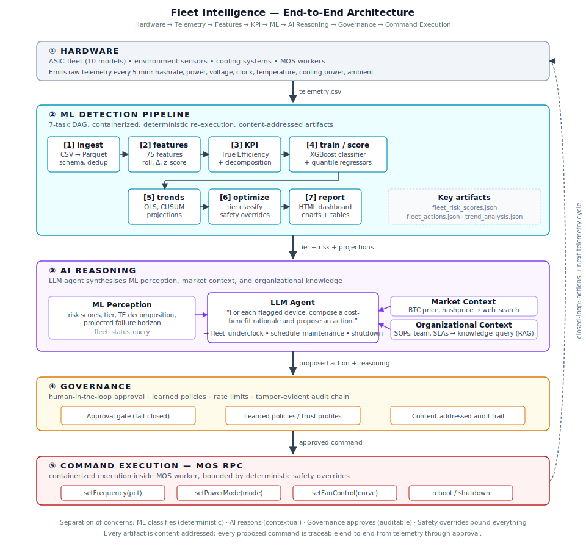

# AI-Driven Mining Optimization & Predictive Maintenance

**Technical Report — MDK Assignment (Tether)**

Wiktor Lisowski · April 2026

---

## 1. Problem Statement

Bitcoin mining profitability now depends on marginal gains. Operators manage heterogeneous ASIC fleets — S21-HYD, M66S, S19XP, S19j/k Pro, A1566 — across sites where ambient conditions, energy price, and hardware health move continuously. Two cost drivers dominate:

- **Chip-level efficiency.** Each ASIC has an operating point defined by clock frequency, core voltage, temperature, and cooling load. Today operators pick modes manually, guided by intuition, using a metric — J/TH — that conflates hardware quality, voltage waste, and cooling overhead.
- **Hardware failure.** ASIC repair is the single largest cost line. Failures almost always manifest as gradual degradation (thermal fouling, PSU drift, chip aging) that is visible in telemetry days before the device goes critical — but there is no systematic early-warning system.

This project addresses both problems with one pipeline. A supervised ML layer identifies degradation and classifies device health; an AI reasoning layer synthesizes that signal with market data and organizational knowledge to propose specific corrective actions; a governance layer enforces human approval and audit before anything touches hardware.

---

## 2. System Architecture

Three functional layers sit between the fleet and the MOS control plane. Each layer has one responsibility and communicates with the next through typed artifacts. The boundaries are the safety story: **ML classifies (deterministic), AI reasons (contextual), Governance approves (auditable), Safety overrides bound everything.**



**① Hardware** emits raw telemetry every 5 minutes: hashrate, power, voltage, clock, chip temperature, cooling power, and ambient temperature. In production this comes from MOS workers (`miningos-wrk-miner-antminer`) via Hyperbee time-series; in this prototype it comes from a physics-based generator.

**② ML Detection Pipeline** is a 7-task DAG: ingest → features → KPI → train/score → trends → optimize → report. Every task runs inside a container, reads and writes to a shared `/work/` directory, and emits content-addressed artifacts. Any task can be rerun in isolation; every rerun produces a new session hash that links its output to its exact inputs, code, and parameters.

**③ AI Reasoning** is an LLM agent that wakes up at the end of each pipeline cycle and gathers three complementary context layers before proposing anything: *ML perception* (risk scores, tier, TE decomposition, projected failure horizon) from the pipeline, *market context* (BTC price, hashprice) from web search, and *organizational context* (SOPs, team availability, hardware specs, financial constraints) from a single-shot RAG query over an indexed corpus of company documents. The agent does not read files directly — all data flows through the same governed API it uses to submit proposals.

**④ Governance** is a human-in-the-loop approval gate with learned policies, per-session rate limits, and a tamper-evident audit trail. Read-only queries auto-approve under a standard profile; anything that changes hardware state requires human confirmation or a standing policy the operator created.

**⑤ Command Execution** is a thin MOS RPC layer: `setFrequency`, `setPowerMode`, `setFanControl`, `reboot`. Critically, MOS does not expose direct voltage control — voltage is coupled to frequency through the ASIC's V/f curve, so all safety reasoning has to be done in frequency-space.

---

## 3. True Efficiency (TE) — the KPI

### 3.1 Why naive J/TH fails

`J/TH = P_asic / H` conflates three independent dimensions that the operator needs to separate:

1. **Cooling overhead.** A miner at 15 J/TH with 400 W of cooling is not the same miner as one at 15 J/TH with 1 kW of cooling.
2. **Voltage waste.** CMOS power scales as V². Overvolting by 30 mV costs disproportionately more power per hash; the naive metric hides whether the chip is on the efficient part of the V/f curve.
3. **Ambient bias.** A device at –5 °C ambient looks better than the same device at +20 °C ambient. Raw J/TH conflates hardware quality with geography.

### 3.2 Formulation

True Efficiency separates what the operator controls from what the environment gives:

```
TE = (P_asic + P_cooling_norm) / (H × η_v)       [J/TH — lower is better]
```

**Voltage efficiency factor** captures how far the operating voltage sits from the minimum stable voltage for the current clock:

```
η_v = (V_optimal(f) / V_actual)²        V_optimal(f) = V_stock × (f / f_stock)^0.6
```

The exponent 0.6 reflects sub-linear V/f scaling in modern CMOS. Overvolting drives η_v below 1; PSU instability appears as η_v volatility.

**Ambient-normalized cooling** removes geographic bias by projecting cooling power to a reference ambient of 25 °C:

```
P_cooling_norm = P_cooling × (T_chip − 25°C) / max(T_chip − T_ambient, 1°C)
```

### 3.3 Diagnostic decomposition

TE factors into three independent components, each mapping to a specific failure mode:

```
TE = TE_base × (1/η_v) × R_cool
```

| Factor | Meaning | Anomaly signal |
|---|---|---|
| `TE_base = P_asic / H` | Hardware-intrinsic efficiency | Hashrate decay (chip aging) |
| `1/η_v` | Voltage penalty | PSU instability, capacitor aging |
| `R_cool = (P + P_cool_norm) / P` | Cooling overhead | Thermal fouling, fan wear |

This decomposition is the critical design choice: rather than training a model on 17 correlated raw signals, we train it on *which TE component is drifting*. Each component isolates a single physical mechanism — so the model's outputs are interpretable, and its predictions map directly onto maintenance categories. A device with a score of 1.0 means nominal performance; below 0.9 triggers investigation, and the decomposition tells the operator **why**.

---

## 4. Data Pipeline

### 4.1 Synthetic dataset

The training corpus (~1.6 M rows) is generated by composing five physics-based scenarios with deterministic seeds. Each scenario uses the same physics engine but a different anomaly mix:

| Scenario | Fleet | Duration | Injected anomalies |
|---|---|---|---|
| baseline | 10 devices | 30 days | none (healthy reference) |
| summer_heatwave | 12 devices | 90 days | thermal degradation, dust fouling, thermal paste degradation |
| psu_degradation | 10 devices | 60 days | PSU instability, capacitor aging |
| cooling_failure | 12 devices | 90 days | thermal degradation, coolant-loop fouling, fan-bearing wear |
| asic_aging | 15 older devices | 180 days | hashrate decay, solder-joint fatigue, firmware cliff |

The physics engine implements per-device, per-timestep simulation with a CMOS power model (`P = k·V²·f + P_static(T)`), a thermal model (exponential approach to equilibrium with thermal inertia τ = 0.4 h), a proportional cooling controller, rule-based mode selection, and sinusoidal ambient temperature seeded at 64.5°N for realistic seasonal/diurnal swings.

### 4.2 Feature engineering

The feature strategy follows directly from the TE decomposition. Rather than feed raw telemetry to the model, we engineer features that isolate the physical mechanism each TE component exposes:

- **Rolling statistics** at four horizons (30 min, 1 h, 12 h, 24 h, 7 d) — capture gradual degradation at multiple timescales.
- **Fleet-relative z-scores** — detect single-device deviation against same-model peers, providing natural resistance to site-wide drift (e.g., a heatwave that affects everyone equally is not an anomaly).
- **Rates of change** — flag sudden shifts (firmware cliffs, fan failures).
- **Interaction terms** — encode physics relationships directly: power-per-GHz, thermal headroom, cooling effectiveness.

The classifier trains on 50 of 75 engineered features; the quantile regressor adds 8 autoregressive temporal features for forward projection.

---

## 5. AI Layer & Results

### 5.1 Classification

An XGBoost classifier (`n_estimators=200`, `max_depth=6`, `scale_pos_weight` for class imbalance) is trained on the full 1.6 M-row corpus. Evaluation uses a 24-hour sliding window on held-out temporal windows across each scenario. The decision threshold is set at 0.3 — biased toward recall, because in mining a missed failure costs far more than an unnecessary inspection.

Device-level evaluation across all non-baseline scenarios:

| Metric | Value |
|---|---|
| Recall | **88 %** |
| Precision | **85 %** |
| True Positives / False Positives | 23 / 4 |
| False Negatives / True Negatives | 3 / 16 |

Per-scenario F1 scores range from 0.80 (summer_heatwave, psu_degradation) to 0.91 (asic_aging).

### 5.2 Feature importance confirms the KPI thesis

The aggregate model's top features validate the TE decomposition as both an operational metric and a feature-engineering strategy:

1. `true_efficiency` — 31.5 %
2. `voltage_v_std_1h` — 15.8 % (PSU instability marker)
3. `efficiency_jth_fleet_z` — 11.5 % (fleet-relative efficiency deviation)
4. `hashrate_th_fleet_z` — 6.7 % (fleet-relative hashrate deviation)
5. `temperature_c_mean_24h` — 5.2 % (thermal baseline drift)

The weakest signal is dust fouling — it manifests similarly to normal ambient variation, and closing that gap needs ambient-conditioned thermal-resistance features rather than threshold tuning.

### 5.3 Forward-looking predictions

Alongside the classifier, a set of quantile regressors produces horizon predictions (p10 / p50 / p90) at t + 1 h, 6 h, 24 h, and 7 d. The trend analysis task adds OLS slopes, EWMA trends, CUSUM regime-change detection, and projected TE-threshold crossings. This is what turns the system from "alerting" to **forecasting**: for each degrading device, the agent receives a projected failure horizon with a confidence band, not just a probability.

### 5.4 The AI reasoning loop

After each scoring cycle, the orchestrator notifies the LLM agent with the pipeline session hash. The agent queries the three context layers, and for every flagged device composes a cost-benefit rationale like:

> *"BTC $97 200. ASIC-004 at 67.6 °C, efficiency 27 % worse than nominal (27.1 vs 21.3 J/TH). SOP-004 prescribes underclock-first for thermal degradation. Underclocking to 90 % reduces revenue by ~$0.35/day but saves ~$0.84/day in wasted power. Net: +$0.49/day plus extended hardware life. Maintenance window: schedule after Jean returns May 5."*

The agent submits the proposal through the governance API with the pipeline's session hash, so ML evidence and AI proposal appear together in the operator dashboard.

---

## 6. Operational Benefits

- **Failure prevention.** Early-warning signals (days before critical failure) let the operator schedule underclocking or maintenance instead of absorbing the full cost of a failed PSU, fouled heatsink, or burned-out capacitor.
- **Corrected comparisons.** TE makes heterogeneous devices and sites comparable for the first time. The same metric works across the hydro-cooled northern site and air-cooled southern site; operators can decide where to deploy new hardware on real data, not J/TH marketing numbers.
- **Quantified trade-offs.** Every proposed action comes with an explicit $/day calculation built from current BTC price, current efficiency loss, and current power cost. Underclocking is no longer a judgment call — it is a net-positive economic decision with a number on it.
- **Zero approval fatigue at scale.** Learned policies let the operator automate recurring safe patterns ("always approve underclock to 80 % for S19jPro when risk > 0.9") while preserving the audit trail and the human veto.

---

## 7. Security & Safety

An autonomous agent that can underclock, overclock, or shut down mining hardware introduces a class of risk that does not exist in a passive monitoring system. Model error, stale data, prompt injection, or an adversarial input could issue a command that damages hardware, wastes energy, or halts revenue. Defense-in-depth with multiple independent layers — any one of which is sufficient to prevent harm — is the only acceptable posture.

1. **Separation of perception, reasoning, and action.** The ML layer only classifies (deterministic, no side effects). The AI agent only proposes (it cannot execute). The governance layer only approves or denies. A failure in any one layer is caught by the others.
2. **Fail-closed design.** Every proposal has a timeout — no human response means **deny**, not approve. If telemetry is missing, no features are computed and no action is proposed. The system fails toward inaction.
3. **Hard-coded physical limits.** Before tier logic runs, deterministic safety overrides are applied: `T > 80 °C` → force 80 % clock; `T < 10 °C` → sleep (coolant viscosity / PCB condensation risk at the northern site); voltage above 110 % of stock → reset to stock frequency. These bounds live in code, not in prompts — they cannot be overridden by model output or agent reasoning.
4. **Container isolation.** Every task and every agent action runs inside an isolated container with no host-filesystem access and an explicit egress allowlist. API keys are injected at runtime from a secret store, never embedded.
5. **Content-addressed audit chain.** Every workflow execution is identified by a SHA-256 over its code, parameters, and inputs. Every agent proposal is logged with the input state that triggered it, the approval decision, and the execution result. Retroactively changing any input breaks the chain.
6. **Adversarial robustness via fleet-relative features.** A compromised device reporting falsified telemetry diverges from its same-model peers — the z-score features detect this rather than being deceived by it. The residual risk is fleet-wide sensor drift, which is acknowledged and out-of-scope for this iteration.

---

## 8. Future Work

- **Real-fleet validation.** Synthetic data validates the pipeline and KPI design. Real-world failures co-occur, sensors drift, and baselines are non-stationary; dust-fouling detection in particular will need ambient-conditioned features once we have live MOS data.
- **Streaming inference.** Move from 24-hour batch scoring to 5-minute streaming with immediate tier reclassification. The growing-window architecture already accumulates history correctly; the bottleneck is cycle time, not architecture.
- **MOS RPC integration.** The `fleet_underclock` template currently logs the intended MOS command; live integration requires TLS client certificates and the MOS gateway endpoint — a deployment step, not an architecture change.
- **Multi-site orchestration.** Current scope is single-site. Cross-site coordination (hashrate floors, energy-price arbitrage) is a natural extension once the single-site loop is proven on real hardware.

---

**Repository layout:**
`tasks/` (pipeline tasks) · `scripts/` (orchestrators, physics engine) · `workflows/` (DAG declarations) · `docs/` (this report, KPI spec, MOS audit, requirements).

**Workflows:** `mdk.pre_processing`, `mdk.train`, `mdk.score`, `mdk.analyze`, `mdk.generate_corpus`, `mdk.fleet_simulation`.
